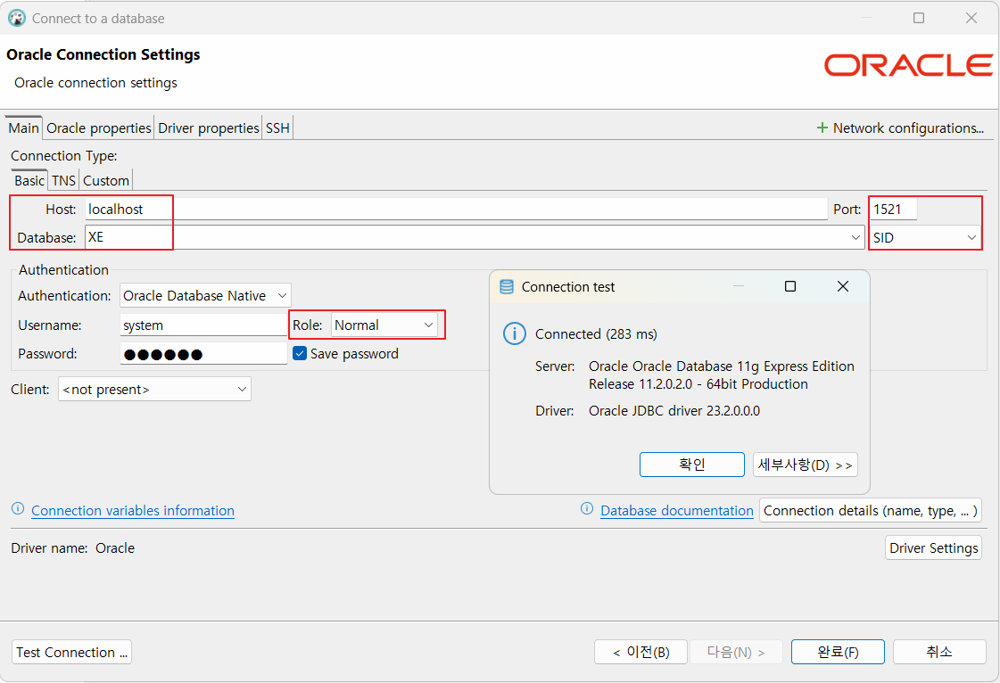
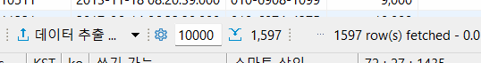
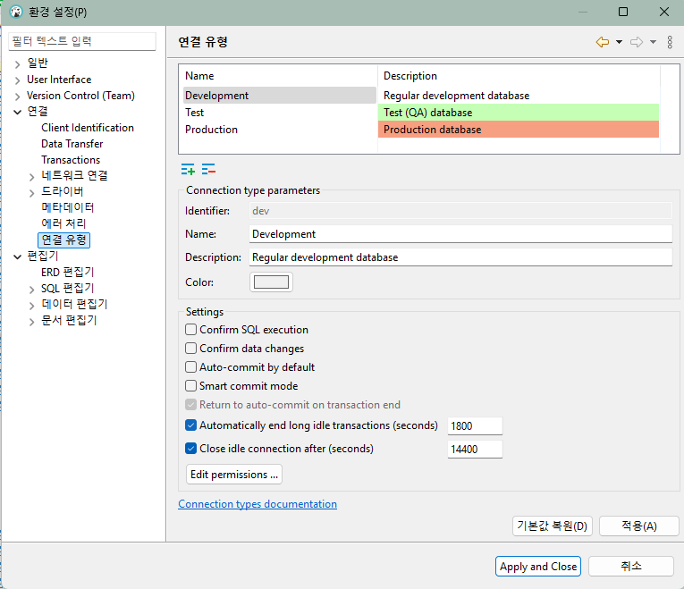

# java-database-2025
### 20250311 성명건 선생님과 오라클 첫날 !!! 화이팅 ~ 근데 오늘이 26일차 수업이야 !!!
Java 개발자 과정 Database 리포지토리(오라클, SQL)

#### cf) 데이터베이스 중 가장 어려운 것 중 하나가 오라클이래..~
  #### 데이터베이스는 모든 개발의 기본 !! 잘 알아두자 !!
## 1일차
1. Github Desktop 설치
    - https://desktop.github.com/download/ 다운로드
    - 기존 Github 계정으로 SignIn with Browser
    - Git 명령어 없이 사용가능

2. Database(DB) 개요
    - 데이터를 저장하는 장소, 서비스를 하는 서버
    - 데이터베이스를 관리하는 프로그램 DBMS
    - 가장 유명한 것이 Oracle(오라클)
    - 사용자는 SQL로 요청, DB서버는 처리 결과를 테이블로 리턴
    - SQL을 배우는 것 !

3. Oracle 설치(Docker)
    1) PowerShell 오픈
       #### 드래그 하고 엔터 치면 복사 가능 !!
    2) docker search로 다운로드하고 싶은 이미지 검색
    3) docker pull 내려받기  # 백틱을 쓰면 명령어 적기 가능 !
        ```shell
        > docker pull oracleinanutshell/oracle-xe-11g
        ```
    4) 다운로드 이미지 확인
        ```shell
        PS C:\User\Admin> docker image ls
        REPOSITORY                        TAG       IMAGE ID       CREATED        SIZE
        ...
        oracleinanutshell/oracle-xe-11g   latest    8b740e77d4b9   6 years ago    2.79GB
    5) 도커 컨테이너 실행
        ```shell
        > docker run --name oracle11g -d -p 1521:1521 --restart=always oracleinanutshell/oracle-xe-11g
        ```
         - 1521 : 오라클 기본포트(Wellknown port / ex: jupyterlab 8888)
         - CHARACKTERSET : 글은 이렇게 쓸 거야!
         - --restart=always : 항상 실행시켜 줘!
         - 아이디 system / oracle (도커 이미지 내부에서 기본적으로 설정된 값)
           > docker exec -it oracle11g bash 하면 아이디와 비번 찾을 수 있다 !
    6) 도커 실행 확인
        : Docker Desktop ; Containers 확인
    7) Powershell 오픈
        ```shell
        > docker exec -it oracle19c bash
        [oracle@0c... ~]$ sqlplus / as sysdba
        SQL >
        ```
    8) DBeaver 접속
        : Connection > Select your DB > Oracle 선택
        

4. DBeaver Community 툴 설치 # 오라클 단독으로는 사용 불가(서버이므로)
    : https://dbeaver.io/download/


5. DML, DDL, DCL
    ; 언어의 특징을 가지고 있음
      > - 프로그래밍 언어와의 차이 : 어떻게(How) ; 어떤 기능으로 뭘 도출할 거야?
      > - SQL : 무엇(What) ; 네가 필요한 데이터는 뭐야?
    - SQL의 구성요소 3가지
     1) DDL(Data Definition Lang)
        : 데이터 베이스 생성, 테이블 생성, 객체 생성, 수정 및 삭제
         > CREATE, ALTER, DROP ...
     2) DCL(Data Control Lang)
        : 사용자 권한 부여, 해제, 트랜잭션 시작 및 종료
         > GRANT, REVOKE, BEGIN TRANS, COMMIT, ROLLBACK
     3) **DML**(Data Manupulation Lang) # 데이터 자체를 조작하는 것
        : 데이터 조작 언어 (** 핵심 !!), 데이터 삽입, 조회, 수정 및 삭제
         > `INSERT`, `SELECT`, `UPDATE`, `DELETE`

6. SELCET 기본  ## 제일 어렵다 !!
    - 데이터 조회 시 사용하는 기본명령어
        ```sql
        -- 기본 주석(한 줄)
        /* 여러줄 주석
          여러 줄로 주석 작성 가능 */
        SELECT [ALL|DISTINCT] [*|컬럼명(들)]
          FROM 테이블명(들)
         [WHERE 검색조건(들)]
         [GROUP BY 속성명(들)]
        [HAVING 집계함수조건(들)]
         [ORDER BY 정렬속성(들) ASC|DESC]
          [WITH ROLLUP]
        ```
    - 기본 쿼리 연습 : [SQL](./day01/sql01_select기본.sql)
        1) 기본 SELECT
        2) WHERE 조건절
        3) NULL (!)
        4) ORDER BY 정렬
        5) 집합

7. 함수(내장함수)
    - 문자함수 : [SQL](./day01/sql02_함수.sql)
    - 숫자함수

#### 20250312 27번째 수업 ??!!!
## 2일차
#### F2 : 이름 바꾸기 / F3 : 새로 만들기 꼭 기억하자 !!
- 함수 (계속)
    - 문자함수 부터: [sql](./day02/sql01_함수계속.sql)
    - 숫자함수
    - 날짜함수
    - 형변환함수
- 복수행함수 : [sql](./day02/sql02_복수행함수.sql)
    - 집계함수
    - GROUP BY
    - HAVING
    - ROLLUP
    - RANK, DENSE_RANK, ROW_NUMBER

8. 데이터베이스 타입형  ** 실무에서 제일 실수 많이 함 !! 기억해두자 !!
    - **CHAR(n)** : 고정형 문자열, 최대 2000bytes
        - CHAR(20)으로 'Hello World'를 입력하면, 'Hello World         '로 저장 !(공백 포함)
        - 기준코드나 반드시 자리수를 지켜야하는 데이터 필요. ex) 주민번호 등 !
    - **VARCHAR2(n)** : 가변형 문자열, 최대 4000bytes
        - VARCHAR2(20)로 'Hello World'를 저장하면, 'Hello World'로 저장! (공백 없음)
    - **NUMBER(p,s)** : 숫자값, p 전체 자리 수, s 소수점 길이. 최대 22byt
    - INTEGER : 모든 데이터의 기준. 4byte, 정수를 담는 데이터형
    - FLOAT(p) : 실수형 타입, 최대 22byte
    - **DATE** : 날짜 타입
    - **LONG(n)** : 가변길이 문자열, 최대 2Gbytes
    - LONG RAW(n) : 원시 이진 데이터, 최대 2Gbytes
    - CLOB : 대용량 텍스트 데이터타입, 최대 4G
    - BLOB : 대용량 바이너리 데이터타입, 최대 4G
    - BFILE : 외부파일에 저장된 테이터, 4G


#### 20250313 sql 3일차 !!!! 총 열흘한대 !! 넘 작아!!!!!
## 3일차 !!!
- JOIN : [sql](./day03/sql03_조인기본.sql)
    - ERD(Entitiy Relationship Diagram) : 개체 관계 다이어그램 ** 제일 중요한 것 !!
        > - PK(Primary Key) : 기본 키. ; 중복이 안 되며 빠진 데이터가 하나도 없다. (UNIQUE, NOT NULL)
        > - FK(Foreign Key) : 외래 키. ; 다른 엔티티(테이블)의 PK. 두 엔티티의 관계를 연결해주는 값
        > - Relationship : 부모 엔티티와 자식 엔티티 간의 연관, 부모, 1, 자식 N을 가질 수 있음
    - 카티션곱
        - 두 개 이상의 테이블의 조건과 관계 없이 연결할 수 있는 경우의 수 전체로 만든 데이터
        - 조인 이전에 데이터 확인 ; 실무에서 카티션곱으로 데이터를 사용할 일이 절! 대! 없음 !! 
    - 내부조인
        - 다중 테이블에서 보통 PK와 FK간의 일치하는 데이터를 한꺼번에 출력하기 위한 방법
        - 관계형 데이터베이스에서 필수로 사용해야 함 !!
        - INNER JOIN 또는 오라클 간결문법 사용
    - 외부조인
        - PK와 FK간 일치하지 않는 데이터도 출력하고자 할 때 사용하는 방법
        - LEFT OUTER JOIN, RIGHT OUTER JOIN 또는 오라클 간결 문법 사용

- DDL : [sql](./day03/sql04_DDL.sql)
    - CREATE ; TABLE, VIEW, PROCEDURE, FUNCTION ... 개체를 생성하는 키워드
        - 타입형
        ```sql
        CREATE TABLE 테이블명 (
            첫번째_컬럼   타입형  제약조건,
            두번째_컬럼   타입형  제약조건,
        
            ...
            마지막_컬럼   타입형  제약조건
            [
            기본키, 외래키 등의 옵션...
            ]
        );
        ```
    - ALTER - 개체 중 테이블에서 수정이 필요할 때 사용하는 키워드
        ```sql
        ALTER TABLE 테이블명 ADD (컬럼명 타입형 제약조건);
        ALTER TABLE 테이블명 MODIFY (컬럼명 타입형 제약조건);
        ```
    - DROP - 개체 삭제 시 사용하는 키워드
        ```sql
        DROP TABLE 테이블명 purge; -- purge - 휴지통
        ```
    - TRUNCATE - 테이블 완전 초기화 키워드
        ```sql
        TRUNCATE TABLE 테이블명;
        ```

#### 20250314 sql 4번째 수업 !!! 총 29번째 수업!! 허걱쓰~~!
## 4일차
- VS Code DB플러그인
    - 확장 > Database 검색 > Database client(Weijan Chen) > 확장중 Database 선택

    
    > CF) 
    >     : 표시할 TABLE의 ROW를 지정할 수 있다 !!
- DML : [INSERT쿼리](./day04/sql01_INSERT.sql), [UPDATE/DELETE쿼리](./day04/sql02_UPDATE_DELETE.sql)
    - INSERT - 테이블에 새로운 데이터를 삽입하는 명령
        - 한 건씩 삽입
        ```sql
        INSERT INTO 테이블명[(컬럼리스트)]
        VALUES (값리스트);
        ```
        - 여러 건 한꺼번에 삽입

    - UPDATE - 데이터 변경. **WHERE 조건을 없이 실행**하면 테이블 모든 데이터가 수정(주의!!)
        ```sql
        UPDATE 테이블명 SET
            컬럼명 = 변경할 값,
            [컬럼명 = 변경할 값]  -- 반복
        [WHERE 조건]    
        ``` 
    - DELETE - 데이터 삭제. **WHERE 조건 없이 실행**하면 테이블의 모든 데이터가 삭제(주의 !!)
        ```sql
        DELETE FROM 테이블명
        [WHERE 조건];
        ```
- 트랜잭션 : [트랜젝션쿼리](./day04/sql03_트랜잭션.sql)
    - 논리적인 처리단위.
    - 은행에서 돈을 찾을 때 아주 많은 테이블 접근해서 일을 처리
        - 적어도 7·8개 이상의 테이블에 접근해서 조회하고 업데이트 수행
        : 수많은 테이블을 거쳐 원하는 정보와 명령을 처리 !!! (예시) ; 트랜잭션 하나
        > - ATM 기계 정보 테이블, 회원 테이블 비밀번호 확인, 계좌정보, 계좌금액 입출금 내역 테이블,
        > - 계좌정보 테이블, 계좌 금액 입출금 내역 테이블 금액 빼기, ATM 기계 총 지폐 정보 테이블,
        > - 영수증 관련 정보 테이블, ATM 기계 정보 테이블, 은행 로그 테이블
        - 제대로 일이 처리 되지 않으면 원상복귀 !
        - DB 설정 AUTO COMMIT 해제 권함 !!
        
        - **ROLLBACK은 트랜잭션 종료가 아님 !!** COMMIT만 종료!!
         
        ```sql
        SET TRANSACTION READ WRITE;      -- 트랜잭션 시작(옵션 ; 안 써도 됨 !!)
        COMMIT;                          -- 트랜잭션 확정
        ROLLBACK;                        -- 원상복귀
        ```
- 제약조건(Constranint) : [제약조건쿼리](./day04/sql04_제약조건.sql)
    - 잘못된 데이터가 들어가지 않도록 막는 기법
        - PRIMARY KEY - 기본키, UNIQUE & NOT NULL
        - FORIEGN KEY - 외래키, 다른 테이블 PK에 없는 값을 가져다 쓸 수 없음
        - NOT NULL - 값이 빠지면 안 됨
        - UNIQUE - 들어간 데이터가 중복되면 안 됨
        - CHECK - 기준에 부합하지 않는 데이터는 입력되면 안 됨
        - DEFAULT - NULL 입력 시 기본값이 입력되도록 하는 제약 조건 
        ```sql
        CREATE TABLE 테이블명(
            컬럼 생성 시 제약조건 추가
        );
        ALTER TABLE 테이블명 ADD CONSTRAINT 제약조건
        ```
- INDEX : [INDEX쿼리](./day04/sql05_인덱스.sql), [인덱스용테이블생성](./ref/bulk_data_insert.sql)
    - 책의 찾아보기와 동일한 기능
    - 검색을 매우 빨리 할 수 있도록 해줌
    - B(alanced) Tree를 사용해서 검색횟수를 log(n)건으로 줄임
    - 인덱스 종류
        - 클러스터드(Clusterd) 인덱스 (테이블 당 1개)
            - **PK에 자동으로 생성**되는 인덱스 (아주 빠름!!)
            - PK가 없으면 처음으로 설정되는 UNIQUE 제약 조건의 컬럼에 생성
        - 보조(Non-Clusterd) 인덱스 (여러개)
            - 사용자가 추가하는 인덱스
            - 클러스터드 인덱스보다 조금 느림
    - 유의점
        - PK에 자동 인덱스 후 컬럼에 UNIQUE를 걸어도 인덱스가 생성되지 않음 !! 수동으로 생성 필요!
        - WHERE절에서 검색하는 컬럼은 인덱스를 걸어주는 것이 성능 향상에 도움됨~
        - 인덱스는 한 테이블 당 4개 이상 걸면 성능이 저하됨
        - NULL값이 많은 컬럼에 인덱스는 성능 저하
         > NULL값도 중복으로 생각하기 때문!! 중복이 많으면 찾기 힘듦(NOT UNIQUE)
        - INSERT, UPDATE, DELETE가 많이 발생하는 테이블에 인덱스를 걸면 성능(속도)이 저하됨 !!
         > 데이터를 새로 만들면 인덱스도 새로 생성됨!! (PK와는 다름~)
         ```sql
         CREATE INDEX 인덱스명 ON 테이블명(인덱스를 걸 컬럼명)
         ```

## 5일차
- VIEW 
- 서브쿼리
- 시퀀스
