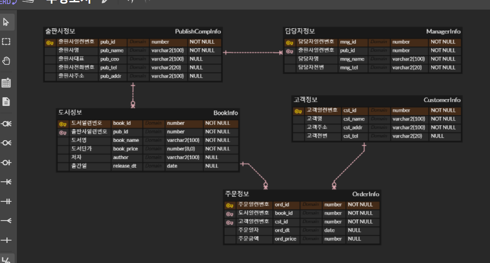
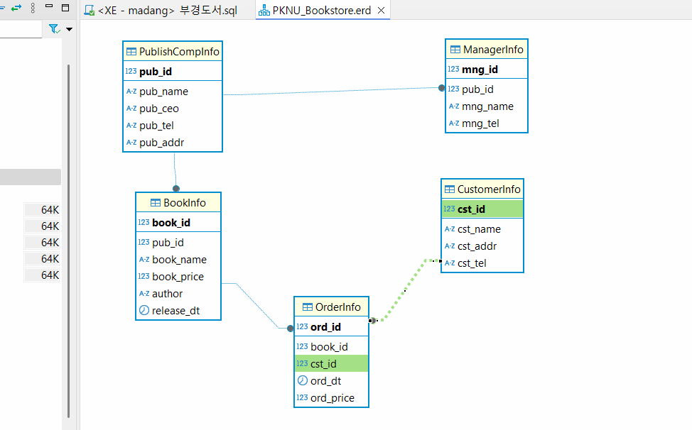

#### 20250319 sql 7번째 수업!!! 근데 한 달이나 지난 것 같아!!!!
## 토이프로젝트
    ; Python GUI - ORacle 연동 프로그램

### GUI 프레임워크
    > 요새는 파이썬으로도 다 만들 수 있대~

- GUI 프레임워크 종류
    1. tkinter : 파이썬에 내장된 GUI 라이브러리, 중소형 프로그램. *간단하게 사용 가능!*
        > 따로 깔지 않아도 됨 !! **근데 안 예쁨**

    2. PyQt / PySide : C/C++에서 사용하는 GUI 프레임워크 Qt를 파이썬에 사용하게 만든 라이브러리.
        > 현재 6버전 출시, **유료**
        - PyQt의 사용라이선스 문제로 PySide 출시.
            > PyQt에서 PySide로 변경하는데 번거로움이 존재 !
        - tkinter보다 난이도가 있음 
        - **아주 예쁨.** Qtdesigner툴로 포토샵처럼 GUI를 디자인 가능 !!
            > Python GUI 중에서 가장 많이 사용 중 !!

    3. Kivy
        - OpenGL(게임엔진용 3D 그래픽엔진)으로 구현되는 GUI 프레임워크
        - 안드로이드, iOS 등 모바일용으로도 개발 가능!! (다양한 플랫폼 지원)
        - 최신 기술이라 아직 불안정함.

    4. wxPython
        - Kivy처럼 멀티플랫폼 GUI 프레임워크
        - **무지 어려움**

### PyQt5 GUI 사용 !!
- PyQt5 설치
    - 콘솔 `>pip install PyQt5`
    > 항상 최신 버전이 좋은 것만은 아니다~

- QtDesigner 설치
    > https://build-system.fman.io/qt-designer-download 다운로드 후 설치

    

#### PyQt5 개발
1. PyQt 모듈 사용 윈앱 만들기
2. 윈도우 기본설정
3. PyQt 위젯 사용법(레이블, 버튼, ...)
4. 시그널(이벤트) 처리방법
5. QtDesigner로 화면디자인, PyQt와 연동

    

#### Oracle연동 GUI개발 시작!!
- 오라클 Python연동 DB(스키마) 생성
    ```sql
    --sys(sysdba)로 작업
-- 20250319 파이썬과 데이터베이스 연동 !!

-- madang 스키마, 사용자 생성
CREATE USER madang IDENTIFIED BY madang;

-- 권한 설정
GRANT CONNECT, resource TO madang;

-- madang으로 사용 및 스키마 변경 !!

-- 테이블 Student 생성
CREATE TABLE Students (
	std_id 		NUMBER PRIMARY KEY,
	std_name 	varchar2(100) NOT NULL,
	std_mobile 	varchar2(15) NULL,
	std_regyear number(4,0) NOT NULL
);

-- Students용 시퀀스 생성
CREATE SEQUENCE SEQ_STUDENT
	INCREMENT BY 1     -- 숫자를 1씩 증가
	START WITH 1; 	   -- 1부터 숫자가 증가됨
    ```

- Student 테이블 생성, 더미데이터 추가
    ```sql
    -- madang으로 로그인
    -- 조회
    SELECT * FROM Students;

    -- 더미데이터 삽입
    INSERT INTO Students (std_id, std_name, std_mobile, std_regyear)
    VALUES(SEQ_STUDENT.nextval, '홍길동', '010-9999-8888', 1997);

    INSERT INTO Students (std_id, std_name, std_mobile, std_regyear)
    VALUES(SEQ_STUDENT.nextval, '홍길순', '010-9999-8877', 2000);

    COMMIT;
    ```

#### 20250320 sql 8일차 수업 !!!!!!
## 7,8일차 !!!
- Python 오라클 연동 테스트
    - 오라클 모듈
        - oracledb - Oracle 최신버전에 매칭 (**구버전은 안 됨!**)
        - **cx_Oracle** - 구버전까지 잘 됨!
    - [Microsoft C++ Build Tools](https://visualstudio.microsoft.com/ko/visual-cpp-build-tools/) 필요 !
    - Visual Studio Installer 실행
    - 개별 구성요소에서 아래 요소 선택
        - [x] MSVC v1XX - VS 20XX C++ x64/x86 빌드도구
        - [x] C++ CMake Tools for Window
        - [x] Windows 10 SDK(10.0.xxxx)
    - 설치
        - 콘솔에서 `> pip insatall cx_Oracle`
        - 콘솔 오라클연동 : [python](./)
        - DPI-1047오류 발생
        - 64-bit Oracle Client Library가 현재 OS에 설치되지 않았기 때문에 발생하는 현상 !!
        - 아래 사이트에서 버전에 맞는 ORacle Client를 다운로드
        - https://www.oracle.com/kr/database/technologies/instant-client/winx64-64-downloads.html
        - 11g 다운로드
        - 압축해제, 시스템정보 path 등록
        - 재부팅 !
    - 콘솔 테스트 결과
        

    #### 20250321 sql 9번째 수업!!!! 헉 벌써 이렇게됐어 ??!!
- QtDesigner로 화면 구성
        

- PyQt로 Oracle 연동 CRUD 구현
    > (선행작업)[토이프로젝트](./madang_작업쿼리.sql)
    - 조회 SELECT 구현
    - 삽입 INSERT 구현
    - 수정, 삭제 구현
    - 입력값 검증(VAlidation check) 로직
    - DML이 종료된 후 다시 데이터 로드 로직 추가
    - 데이터 삽입 후 라인에디트에 기존 입력값이 남아있는 것 제거 !!

    > cf) 비주얼 스튜디오에서 Ctrl + f5로 터미널을 출력했을 때, 다시 한 번 실행하려면 조그만 창의 정지 버튼을 누르고 완전히 창을 종료한 후 다시 실행시키자!!!
            
    > **반드시 프로그램 하나를 완성시킨 후 다음 프로그램 작성으로 넘어가자 !!!!!!!** 꼭 !!
- 개발 완료!
    - 아이콘 변경 및 추가
    

- 개발 도중 문제 !! ㅇ0ㅇ!! Error ! Error ! Hot Hot Hot Hot Hot issue~
    - [x] DB에 저장된 데이터을 테이블위젯에서 더블클릭한 뒤 수정하지 않고 추가를 눌러도 새로 데이터가 삽입되는 문제 !!
    - [x] 수정모드에서 추가를 한 뒤 학생 번호가 라인에디터에 그대로 존재 !!

### 데이터 베이스 모델링 !!!
- 서점 데이터 모델링
    - 현실세계 데이터를 DB 내에 옮기기 위해서 DB를 설계하는 것 !!
    -모델링 중요점 ; 이것만 알아도 모델링 가능 !!
        1. 객체별로 분리할 것. 객체 >> 테이블
        2. 각 객체별로 어떤 속성을 가지고 있는지 분석, 속성 ; 컬럼
        3. 어느 객체와 어느 객체가 관련이 있는지 분석. ; 관계
        4 . 한 컬럼에 대이터가 하나만 저장되어 있는지 파악 !! 
                > 한 컬럼에 데이터를 두 개씩 넣지 말 것 !!!!
        5. 결정자가 없으면 결정자를 어떻게 만들지 파악. 결정자 ; PK
    
    - 모델링 순서
        1. 객체(entity) 분리 - 고객 정보, 도서 정보, 출판사 정보, 주문 정보
        2. 속성 분리 - 일반속성, 결정자(PK) 속성
    
    - ERD툴 사용해서 모델링
        - ERDCloud.com(웹), ERWin(앱, Draw.io
        
- ERDCloud.com
    1. ERD 생성버튼으로 새 ERD 이름 작성 후 만들기
    
    2. 논리모델링 시작
        - 새 엔티티 추가
        - 엔티티 속성 추가(속성명, 타입, NULL 여부) ; 어떤 프로그램을 쓸지 모르기 때문에 타입은 범용적으로 작성~
        - 결정자(PK) 속성 일부 추가
        - 관계(7가지 아이콘) 연결
        - 필요없는 속성제거, 필요한 속성 추가
    
    3. 물리모델링
        - 엔티티의 테이블 입력
        - 각 속성의 컬럼명 입력
        - DB에 맞게 타입과 크기를 변경(Oracle, MySQL 등)
        

    4. 내보내기
        - DB를 변경
        - PK제약조건, FK제약조건, 비식별제약조건 선택 !!
        - SQL 미리보기로 꼭 확인해보기!!
        - SQL 다운로드 ~
    
    5. DBeaver
        - 내보내기한 sql 오픈
        - 스크립트 실행 !!
        - ER 다이어그램 그리기
            > 우클릭 create - er diagram - 만든 표 데이터 선택해서 다이어그램 만들 수도 있음 !!
        
        

